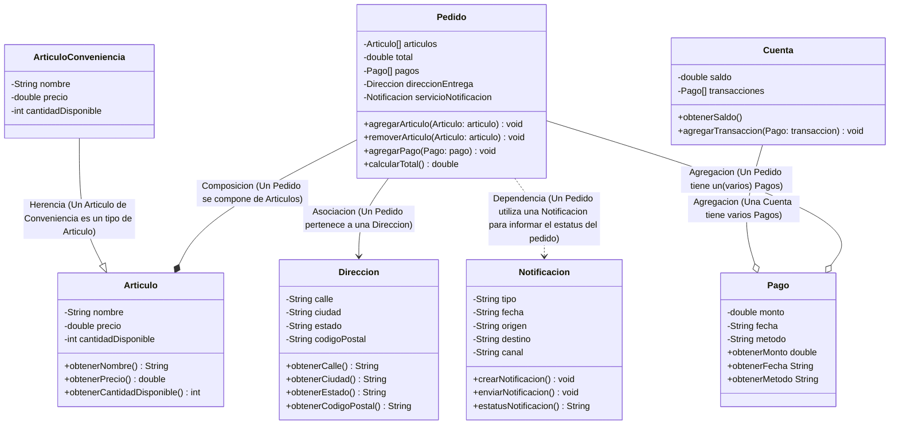

```mermaid 
classDiagram

class Notificacion{
    -String tipo
    -String fecha
    -String origen
    -String destino
    -String canal

    +crearNotificacion() void
    +enviarNotificacion() void
    +estatusNotificacion() String
}

class Articulo{
    -String nombre
    -double precio
    -int cantidadDisponible
    +obtenerNombre() String
    +obtenerPrecio() double
    +obtenerCantidadDisponible() int
}

class ArticuloConveniencia{
    -String nombre
    -double precio
    -int cantidadDisponible
}


class Pedido{
    -Articulo[] articulos 
    -double total
    -Pago[] pagos
    -Direccion direccionEntrega
    -Notificacion servicioNotificacion
    +agregarArticulo(Articulo: articulo) void
    +removerArticulo(Articulo: articulo) void
    +agregarPago(Pago: pago) void
    +calcularTotal() double
}
class Direccion{
    -String calle
    -String ciudad
    -String estado
    -String codigoPostal
    +obtenerCalle() String
    +obtenerCiudad() String
    +obtenerEstado() String
    +obtenerCodigoPostal() String

}
class Pago{
    -double monto
    -String fecha 
    -String metodo
    +obtenerMonto double
    +obtenerFecha String
    +obtenerMetodo String
}

class Cuenta{
    -double saldo
    -Pago[] transacciones 
    +obtenerSaldo()
    +agregarTransaccion(Pago: transaccion) void
}


Pedido --> Direccion: Asociacion (Un Pedido pertenece a una Direccion)
Pedido --* Articulo : Composicion (Un Pedido se compone de Articulos)
Pedido --o Pago : Agregacion (Un Pedido tiene un(varios) Pagos)
Cuenta --o Pago: Agregacion (Una Cuenta tiene varios Pagos)
ArticuloConveniencia --|> Articulo: Herencia (Un Articulo de Conveniencia es un tipo de Articulo)
Pedido ..> Notificacion: Dependencia (Un Pedido utiliza una Notificacion para informar el estatus del pedido)

```